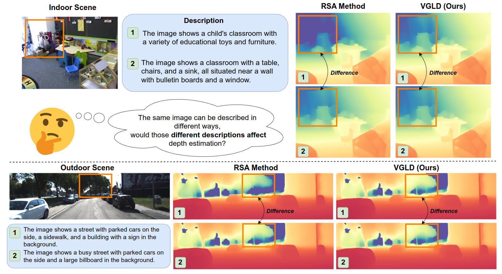

<div align="center">
<h1>VGLD: Visually-Guided Linguistic Disambiguation for Monocular Depth Scale Recovery</h1>


<a href="https://arxiv.org/abs/2505.02704"></a>

**School of Physics and Optoelectronic Engineering, Guangdong University of Technology**

Bojin Wu, Jing Chen

**We propose VGLD, a lightweight framework that uses visual semantics to resolve linguistic ambiguity in monocular depth scale recovery, enabling accurate and robust metric depth estimation.**


</div>


```bibtex
@article{wu2025vgld,
  title={VGLD:Visually-Guided Linguistic Disambiguation for Monocular Depth Scale Recovery},
  author={Wu, Bojin and Chen, Jing},
  journal={arXiv preprint arXiv:2505.02704},
  year={2025}
}
```

## Updates

- [Aug 8, 2025] Paper, code and checkpoints are all released.

## Pre-trained Models

We provide **six models** for robust depth scale recovery.

| Model               | Params | Checkpoint                                      |
|---------------------|--------|-------------------------------------------------|
| vgld_dav1_nk_t      | 3.2M   | `./checkpoints/vgld_dav1_nk_t.pth`             |
| vgld_dav1_nk_i      | 3.2M   | `./checkpoints/vgld_dav1_nk_i.pth`             |
| vgld_dav1_nk_tci    | 4.7M   | `./checkpoints/vgld_dav1_nk_tci.pth`           |
| vgld_midas-1_nk_t   | 3.2M   | `./checkpoints/vgld_midas-1_nk_t.pth`          |
| vgld_midas-1_nk_i   | 3.2M   | `./checkpoints/vgld_midas-1_nk_i.pth`          |
| vgld_midas-1_nk_tci | 4.7M   | `./checkpoints/vgld_midas-1_nk_tci.pth`        |


## Quick Start

---
### Prepraration
First, clone this repository to your local machine, and install the dependencies.

```bash
git clone https://github.com/pakinwu/VGLD.git
mkdir modules; cd modules
git clone https://github.com/isl-org/MiDaS.git
git clone https://github.com/DepthAnything/Depth-Anything-V2.git
git clone https://github.com/openai/CLIP.git

conda create -n vgld python=3.8 -y
conda activate vgld
conda install pytorch==2.1.1 torchvision==0.15.2 torchaudio==2.0.2 pytorch-cuda=11.8 -c pytorch -c nvidia -y
pip install tensorboardX pandas==2.1.3 opencv-python==4.8.0.76 tensorboard==2.14.0 timm==0.6.12 scipy matplotlib scikit-image scipy==1.11.4
cd ./modules/CLIP; pip install -e .;cd ../../
```

### Data Prepraration
```
data/
├── kitti/
│   └── ...                  # KITTI 
└── nyu/
    ├── dav1_vits/           # opt. Relative Depth map created by DepthAnythingv1
    ├── dav2_vits/           # opt. Relative Depth map created by DepthAnythingv2 
    ├── xxx/                 # Placeholder for other potential outputs or features
    ├── raw_data/            # Must!
    │   ├── official_splits/ 
    │   │   └── test/
    │   │       ├── bathroom/
    │   │       │   ├── rgb_00045.jpg
    │   │       │   └── xxx.jpg
    │   │       └── xxx/      
    │   └── sync/              
    │       ├── basement_0001a/
    │       │   ├── rgb_00000.jpg
    │       │   └── xxx.jpg
    │       └── xxx/           
    └── text/                  # Must! 
        ├── text_nyu_llava-v1.6-mistral-7b_0.json
        └── xxx.json           
```

### Text Prepraration
We utilize the [LLaVA](https://github.com/haotian-liu/LLaVA) model for generating text descriptions for each image. Please refer to the repository for instructions on its usage.

The sample in `text_nyu_llava-v1.6-mistral-7b_0.json` are as follow:
```json
{
    "./data/nyu/raw_data/sync/bedroom_0060/rgb_00093": {
        "text": [
            "The image shows a bedroom with a stuffed animal on a bean bag chair, a desk with various items, and a window with a blue curtain."
        ]
    },
    "./data/nyu/raw_data/sync/bedroom_0060/rgb_00036": {
        "text": [
            "The image shows a messy bedroom with a bed covered in blankets and pillows, a dresser, and a closet."
        ]
    },
    ...
```

### Evalution
1. Evaluate the VGLD model!
```bash
python eval/eval.py --ckpt checkpoints/VGLD/vgld_dav1_nk_tci.pth
```
2.Evaluate the VGLD model with inference_time!
```bash
python eval/eval_inference_time.py --ckpt checkpoints/VGLD/vgld_dav1_nk_tci.pth
```

### Training
1. Training Single Dataset (e.g.NYU)
```bash
python train/train_pipeline_nyu.py --batch_size 8 --epochs 12 --rde_model "dav1" --fusion "tci" --seed 0 --exp_name "train_nyu"
```
2.Training Multi Dataset (e.g.NYU + KITTI) 
```bash
python train/train_pipeline_nk.py --batch_size 8 --epochs 12 --rde_model "dav1" --fusion "tci" --seed 0 --exp_name "train_nk"
```

## Result

| Method*           | NYUV2                     |                       |                       | KITTI                    |                       |                       |
|-------------------|---------------------------|-----------------------|-----------------------|--------------------------|-----------------------|-----------------------|
|                   | Abs Rel ↓                 | RMSE ↓                | D1 ↑                  | Abs Rel ↓                | RMSE ↓                | D1 ↑                  |
| RSA-NK_dav1       | 0.148                   | 0.498                 | 0.776                 | 0.158                    | 4.457                 | 0.786                 |
| vgld_dav1_nk_t    | 0.142                     | 0.483                 | 0.787                 | 0.148                    | 4.293                 | 0.844                 |
| vgld_dav1_nk_i    | 0.114                     | 0.404                 | 0.880                 | 0.142                    | 4.151                 | 0.868                 |
| vgld_dav1_nk_tci  | **0.112**               | **0.392**             | **0.883**             | **0.136**                | **4.008**             | **0.874**             |
| RSA_midas-1_NK    | 0.168                     | 0.561                 | 0.737                 | 0.160                    | 4.232                 | 0.782                 |
| vgld_midas-1_nk_t | 0.159                     | 0.526                 | 0.751                 | 0.130                    | 3.744                 | 0.844                 |
| vgld_midas-1_nk_i | 0.123                     | 0.426                 | 0.855                 | 0.122                    | 3.574                 | 0.868                 |
| vgld_midas-1_nk_tci | **0.120**               | **0.414**             | **0.863**             | **0.120**                | **3.559**             | **0.874**             |


## License
See the [LICENSE](./LICENSE.txt) file for details about the license under which this code is made available.


